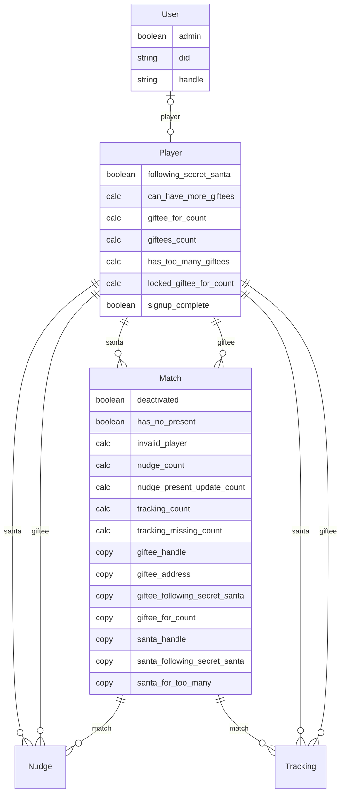
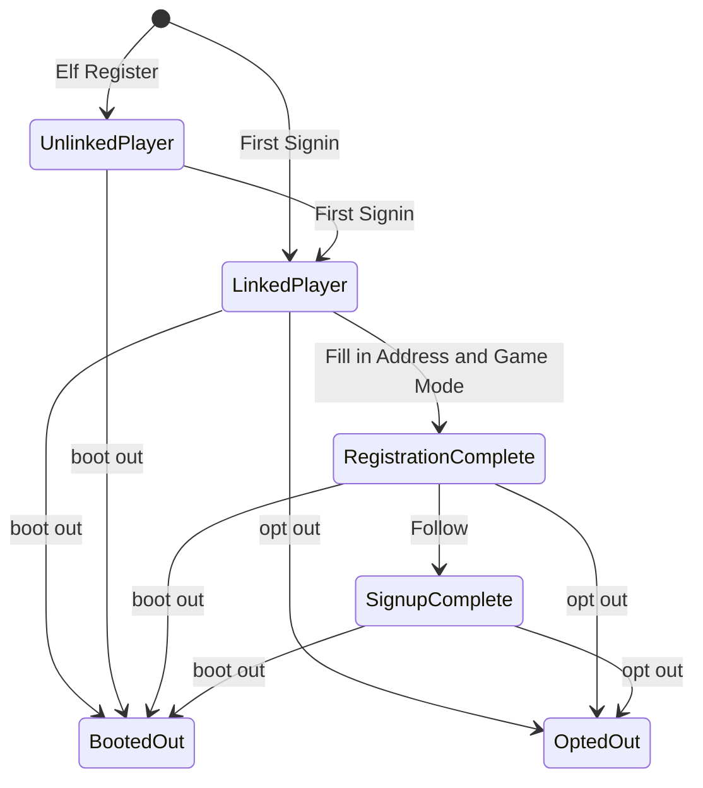

## Entities



## Backend Workflow
### Update Player Counts

```
Player.giftee_for_count = count matches where giftee = player
Player.giftees_count = count matches where santa = player
Player.locked_giftee_for_count = count matches where santa = player AND status locked

Player.can_have_more_giftees = player.giftees_count < player.max_giftees
Player.has_too_many_giftees = player.giftees_count > player.max_giftees

For each match where giftee = player:
  match.giftee_for_count = player.giftee_for_count

For each match where santa = player:
  match.santa_for_too_many = player.has_too_many_giftees
```

### Player Changed

```
Player.signup_complete = !deactivated & address & game_mode & following

For each match where giftee = player:
  match.giftee_handle = player.bluesky_handle
  match.invalid_player = match.santa.deactivated || match.giftee.deactivated
  match.giftee_address = player.address
  match.giftee_following_secret_santa = player.following_secret_santa

For each match where santa = player:
  match.santa_handle = player.bluesky_handle
  match.invalid_player = match.santa.deactivated || match.giftee.deactivated
  match.santa_following_secret_santa = player.following_secret_santa

Trigger => Update Player Counts
```

### Tracking Changed

```
tracking.match.tracking_count = count tracking where tracking.match = match
tracking.match.tracking_missing_count = count tracking where tracking.match = match and missing
tracking.match.has_no_present = tracking.match.tracking_count = 0 || tracking.match.tracking_missing_count = 1
```


## Player Lifecycle


